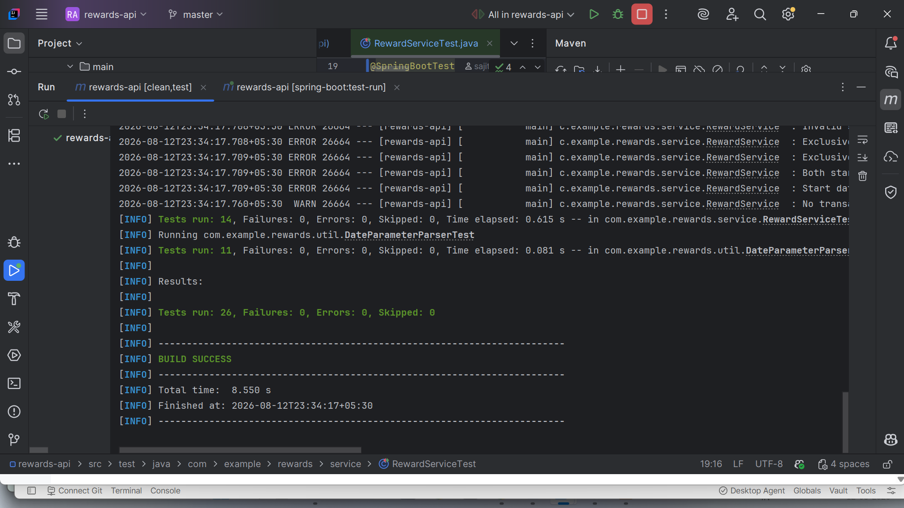

# Rewards API

Calculates customer reward points from retail transactions.

## Rules

- 2 points for every dollar spent **over $100** in a transaction
- 1 point for every dollar spent **between $50 and $100** in a transaction
- Example: a $120 purchase = 2×$20 + 1×$50 = **90 points**

## Run it

```bash
mvn spring-boot:run
```

Then:

```bash
curl localhost:8080/v1/calculateRewards?startDate=2026-05-09&endDate=2026-08-07
```

Returns each customer's points broken down by month, plus a running total: for the date range May 9, 2026 to August 7, 2026:

```json
[
  {
    "customerId": "C001",
    "customerName": "Alice Job",
    "monthlyRewards": [
      {
        "year": 2026,
        "month": "MAY",
        "points": 25,
        "transactionIds": [
          "T0002"
        ]
      },
      {
        "year": 2026,
        "month": "JUNE",
        "points": 250,
        "transactionIds": [
          "T0003",
          "T0004"
        ]
      },
      {
        "year": 2026,
        "month": "JULY",
        "points": 49,
        "transactionIds": [
          "T0005"
        ]
      }
    ],
    "totalPoints": 324
  },
  {
    "customerId": "C004",
    "customerName": "David John",
    "monthlyRewards": [
      {
        "year": 2026,
        "month": "MAY",
        "points": 0,
        "transactionIds": [
          "T00011"
        ]
      },
      {
        "year": 2026,
        "month": "JUNE",
        "points": 0,
        "transactionIds": [
          "T00012"
        ]
      }
    ],
    "totalPoints": 0
  },
  {
    "customerId": "C005",
    "customerName": "Nirmal Xavier",
    "monthlyRewards": [
      {
        "year": 2026,
        "month": "JUNE",
        "points": 90,
        "transactionIds": [
          "T00013"
        ]
      },
      {
        "year": 2026,
        "month": "JULY",
        "points": 10,
        "transactionIds": [
          "T00014"
        ]
      }
    ],
    "totalPoints": 100
  },
  {
    "customerId": "C003",
    "customerName": "Priya Sharma",
    "monthlyRewards": [
      {
        "year": 2026,
        "month": "MAY",
        "points": 470,
        "transactionIds": [
          "T0008"
        ]
      },
      {
        "year": 2026,
        "month": "JUNE",
        "points": 370,
        "transactionIds": [
          "T0009"
        ]
      },
      {
        "year": 2026,
        "month": "JULY",
        "points": 210,
        "transactionIds": [
          "T00010"
        ]
      }
    ],
    "totalPoints": 1050
  },
  {
    "customerId": "C002",
    "customerName": "Sonu Venu",
    "monthlyRewards": [
      {
        "year": 2026,
        "month": "JULY",
        "points": 151,
        "transactionIds": [
          "T0007"
        ]
      }
    ],
    "totalPoints": 151
  }
]
```
```bash
curl localhost:8080/v1/calculateRewards
```
Returns each customer's points broken down by month, plus a running total: for the default date range of the last 3 months:

```json
[
  {
    "customerId": "C001",
    "customerName": "Alice Job",
    "monthlyRewards": [
      {
        "year": 2026,
        "month": "MAY",
        "points": 25,
        "transactionIds": [
          "T0002"
        ]
      },
      {
        "year": 2026,
        "month": "JUNE",
        "points": 250,
        "transactionIds": [
          "T0003",
          "T0004"
        ]
      },
      {
        "year": 2026,
        "month": "JULY",
        "points": 49,
        "transactionIds": [
          "T0005"
        ]
      }
    ],
    "totalPoints": 324
  },
  {
    "customerId": "C004",
    "customerName": "David John",
    "monthlyRewards": [
      {
        "year": 2026,
        "month": "JUNE",
        "points": 0,
        "transactionIds": [
          "T00012"
        ]
      }
    ],
    "totalPoints": 0
  },
  {
    "customerId": "C005",
    "customerName": "Nirmal Xavier",
    "monthlyRewards": [
      {
        "year": 2026,
        "month": "JUNE",
        "points": 90,
        "transactionIds": [
          "T00013"
        ]
      },
      {
        "year": 2026,
        "month": "JULY",
        "points": 10,
        "transactionIds": [
          "T00014"
        ]
      },
      {
        "year": 2026,
        "month": "AUGUST",
        "points": 2,
        "transactionIds": [
          "T00015"
        ]
      }
    ],
    "totalPoints": 102
  },
  {
    "customerId": "C003",
    "customerName": "Priya Sharma",
    "monthlyRewards": [
      {
        "year": 2026,
        "month": "JUNE",
        "points": 370,
        "transactionIds": [
          "T0009"
        ]
      },
      {
        "year": 2026,
        "month": "JULY",
        "points": 210,
        "transactionIds": [
          "T00010"
        ]
      }
    ],
    "totalPoints": 580
  },
  {
    "customerId": "C002",
    "customerName": "Sonu Venu",
    "monthlyRewards": [
      {
        "year": 2026,
        "month": "JULY",
        "points": 151,
        "transactionIds": [
          "T0007"
        ]
      }
    ],
    "totalPoints": 151
  }
]
```
```bash
curl localhost:8080/v1/calculateRewards?startDate=2026-05-09
```
Returns an error because the end date is missing:

```json
{
  "details": "Both start date and end date must be provided together or both must be null.",
  "statusCode": 400,
  "timestamp": "2026-08-12T22:22:47.8882322"
}
```
```bash
curl localhost:8080/v1/calculateRewards?endDate=2026-08-07
````
Returns an error because the end date is missing:
```json
{
  "details": "Both start date and end date must be provided together or both must be null.",
  "statusCode": 400,
  "timestamp": "2026-08-12T22:22:47.8882322"
}
```
```bash
curl localhost:8080/v1/calculateRewards?startDate=2026-08-09&endDate=2026-05-07
```
Returns an error because the start date is after the end date:

```json
{
  "details": "Start date must be before or equal to end date.",
  "statusCode": 400,
  "timestamp": "2026-08-12T22:38:59.1651701"
}
```

## Test it

```bash
mvn test
```
``screnshot

...
## Health check

```bash
curl http://localhost:8080/actuator/health
```
## Prometheus metrics

```bash
curl http://localhost:8080/actuator/prometheus
```

Covers the points formula at each tier boundary ($50, $100), the worked
example from the spec ($120 → 90 pts), a customer who never crosses $50
(zero points), and a full-stack MockMvc test on the endpoint.

## Design notes

- **`RewardService.calculatePoints`** is a small pure function — easy to
  unit test in isolation from HTTP/aggregation concerns.
- **`BigDecimal`** is used throughout for money instead of `double`, to
  avoid floating-point rounding errors on currency.
- Transactions are seeded in-memory (`TransactionRepository`) rather than
  backed by a real database, since the assignment calls for a made-up
  data set . Swapping in a JPA repository later
  would only touch that one class.
- Aggregation groups by customer, then by `YearMonth`, using a
  `TreeMap` to keep months in chronological order in the response.
